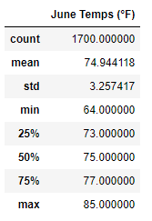
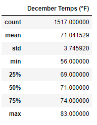
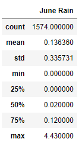
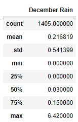

# surfs_up  - Module 9 Challenge

## Overview of the Analysis

The purpose of this analysis is to analyze temperature data for the months of June and December to support the business plans of a new surf shop. This will determine whether it is feasible to run the shop all year successfully. SQLAlchemy will be used to take the weather data for the months of June and December to get statistics for the analysis.

## Resources Used
- Data Source: hawaii.sqlite
- Software: SQLAlchemy 1.4.27, Python 3.7.6, Visual Studio Code 1.63.2, Conda 4.11.0, Jupyter Notebook 6.4.6

## Results

Two summary tables were produced, one for the month of June and one for the month of December. The two tables are shown below.




Some key facts that can be taken from the produced data is:

- The average temperature was three degrees higher in June compared to December, indicating it is warmer in June.
- The standard deviation of temperatures was higher in December compared to June, indicating temperature is more volatile.
- Related to the standard deviation, December had a much bigger range of values, from 56 to 83 degrees. The minimum in particular would be concerning to the surf shop.

## Summary

Overall the summary data of June and December indicates that the surf shop should be successful year round based on the average temperature, which was only three degrees lower in December compared to June. However, the larger deviation and range of temperatures in December may indicate there will be more frequent days in December where the surf shop will not do well.

This analysis can be supported with more targeted weather data. As an example, the precepitation data can be extracted using a different query as shown for June:

```
june_rain = session.query(Measurement.prcp).filter(extract('month', Measurement.date) == 6).all()
june_rain_df = pd.DataFrame(june_rain, columns=['June Rain'])
june_rain_df.describe()
```
and December:
```
dec_rain = session.query(Measurement.prcp).filter(extract('month', Measurement.date) == 12).all()
dec_rain_df = pd.DataFrame(dec_rain, columns=['December Rain'])
dec_rain_df.describe()
```
A similar comparison can then be made for precipitation as well as temperature. The tables produced are as shown.




Similar to the temperature data, the query also showed a larger variation in the December data as well as a larger average rainfall, which adds more support that December may be a less effective month to run the surf shop, and more research may be needed to see how effective running the business in December may be compared to other months.